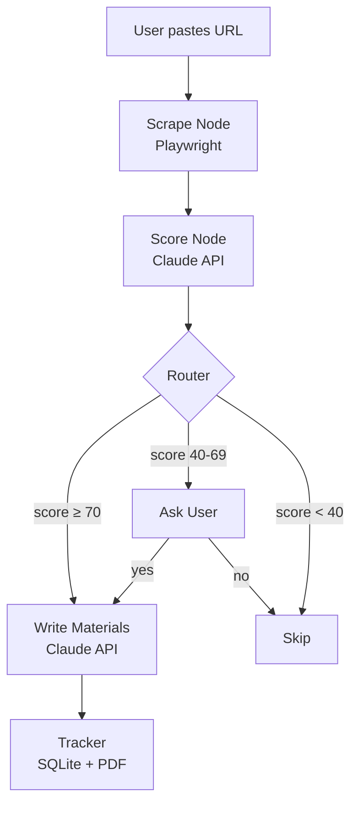

# 🎯 Job Hunter Agent

An AI-powered multi-agent system that automates job application preparation.
Paste a job URL and the agent scrapes the posting, scores your fit, tailors your resume,
writes a cover letter, and drafts a LinkedIn outreach message — all in under 60 seconds.

## Demo
> Add a screenshot or Loom video link here once deployed

## What it does

1. **Scrapes** the job posting from any URL (LinkedIn, Indeed, WTTJ, company pages)
2. **Scores** your fit against your resume (0–100) and identifies strengths and gaps
3. **Routes** automatically — high fit generates materials, medium fit asks you, low fit skips
4. **Writes** a tailored resume, cover letter, and LinkedIn outreach message
5. **Saves** every application to a local SQLite tracker with stage management
6. **Exports** professional PDFs for resume and cover letter

## Architecture



**Nodes:**
- **Scrape** — Playwright renders JS pages and extracts full job description
- **Score** — Claude API compares JD vs resume, returns fit score + strengths + gaps  
- **Router** — conditional edge routing based on fit score thresholds
- **Writer** — Claude API generates tailored resume, cover letter, outreach message
- **Tracker** — saves to SQLite, exports PDFs via ReportLab


## Tech Stack

- **Agent framework:** LangGraph
- **LLM:** Claude (Anthropic API)
- **Scraping:** Playwright
- **UI:** Streamlit
- **PDF generation:** ReportLab
- **Storage:** SQLite
- **Cloud:** AWS (Lambda, S3, SES) — coming in v2

## Setup

1. Clone the repo
```bash
git clone https://github.com/Johnny386/job-hunter-agent.git
cd job-hunter-agent
```

2. Create a virtual environment and install dependencies
```bash
python -m venv venv
source venv/bin/activate  # Windows: venv\Scripts\activate
pip install -r requirements.txt
playwright install chromium
```

3. Add your API key
```bash
# Create a .env file at the root
ANTHROPIC_API_KEY=your-key-here
```

4. Add your resume to `data/master_resume.md` as plain text

5. Run the app
```bash
python -m streamlit run ui/app.py
```

## Project Structure
job-hunter-agent/
├── nodes/          # LangGraph nodes (scrape, score, route, write, track)
├── tools/          # Underlying tool logic (LLM calls, scraping, PDF)
├── memory/         # State schema (JobHunterState)
├── data/           # master_resume.md + jobs.db (auto-created)
├── output/         # Generated PDFs (auto-created, gitignored)
├── ui/             # Streamlit interface
├── graph.py        # LangGraph graph definition
└── main.py         # CLI entry point


## Roadmap

- [x] Application Copilot — paste URL, get tailored materials
- [ ] Scout Agent — daily job discovery across LinkedIn, Indeed, WTTJ
- [ ] Multi-agent orchestration — Scout + Analyst + Writer + Outreach
- [ ] AWS deployment — Lambda + CloudWatch + SES notifications
